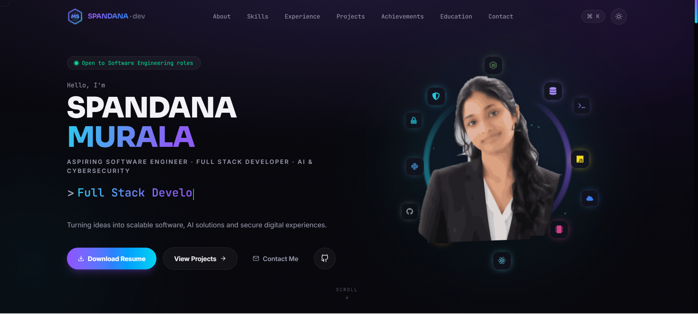

# 🌐 Spandana Murala | Developer Portfolio

A modern developer portfolio showcasing my projects, technical skills, internships, and experience in Software Engineering, Full Stack Development, Artificial Intelligence, and Cybersecurity.

## 🚀 Live Website

👉 **https://spandana-portfolio-ivory.vercel.app/**

---

## 📸 Portfolio Preview



---

## ✨ Features

- Responsive Design
- Dark & Light Mode
- Animated UI using Framer Motion
- Interactive Skills Section
- Featured Projects
- GitHub Integration
- Resume Download
- Contact Form with EmailJS

## Tech stack

| Layer | Technology |
|---|---|
| Framework | Next.js 15 (App Router) |
| Language | TypeScript |
| UI | React 19 |
| Styling | Tailwind CSS v4 |
| Animation | Framer Motion, GSAP |
| 3D | Three.js via React Three Fiber |
| Scrolling | Lenis |
| Icons | react-icons |
| Email | EmailJS |
| Hosting | Vercel |

---

## Running locally

Requires Node.js 18.18 or newer.

```bash
git clone https://github.com/spandana162/spandana-portfolio.git
cd portfolio
npm install
npm run dev
```

Open http://localhost:3000.

### Environment variables

Copy `.env.local.example` to `.env.local` and fill in your EmailJS credentials:

```
NEXT_PUBLIC_EMAILJS_SERVICE_ID=
NEXT_PUBLIC_EMAILJS_TEMPLATE_ID=
NEXT_PUBLIC_EMAILJS_PUBLIC_KEY=
```

Without these the contact form still works — it falls back to opening the visitor's mail client and copying the message to their clipboard.

### Scripts

```bash
npm run dev     # development server
npm run build   # production build
npm run start   # serve the production build
```

---

## Project structure

```
src/
  app/
    layout.tsx           root layout, fonts, metadata
    page.tsx             single-page composition
    projects/[slug]/     generated case-study pages
    sitemap.ts           generated sitemap
    robots.ts            generated robots.txt
  components/
    Hero.tsx             split-screen hero
    HeroPortrait.tsx     animated portrait and orbiting icons
    BrandLogo.tsx        animated brand mark
    ...                  one component per section
    providers/           theme and smooth-scroll providers
  lib/
    data.ts              ALL site content lives here
    utils.ts             shared helpers
public/
  images/                portrait assets
  projects/              per-project screenshots
  resume.pdf             downloadable résumé
```

**To change any text on the site, edit `src/lib/data.ts`.** Content is deliberately separated from presentation so copy changes never require touching a component.

---

## Featured projects

| Project | Stack | Focus |
|---|---|---|
| Gesture Math Solver | Python, OpenCV, MediaPipe | Real-time computer vision, threading, safe expression evaluation |
| AI Interview Platform | React, Node.js, Express, MongoDB | Role-based access control, LLM integration |
| AgriCare | Python, TensorFlow, CNN | Transfer learning, explainable predictions via Grad-CAM |
| Trash Tracker | Flutter, Supabase | Real-time location sync across multiple apps |
| LostNFound | PHP, MySQL | Relational schema design and query optimisation |

---

## Deployment

Deployed on Vercel. Every push to `main` triggers a production build automatically.

```bash
npm run build   # verify locally first
git push        # Vercel builds and deploys
```

---

## Development notes

This project was built with AI assistance for scaffolding and boilerplate, then reviewed, modified and extended by me. Specific problems I worked through:

- **Light theme was unreadable.** Components used hard-coded `text-white`, which stays white on a white background. Fixed by routing every colour through CSS custom properties that are redefined under `html.light`, so utilities flip automatically.
- **Contact form appeared to do nothing.** With EmailJS unconfigured it silently opened a `mailto:` link, which does nothing if no desktop mail client is installed. Now always renders a visible confirmation and copies the message to the clipboard.
- **GitHub stat cards rendered as broken images.** The upstream card service rate-limits aggressively. Added explicit load and error states with a link-out fallback.
- **Hydration mismatch in the hero.** Particle positions were generated with `Math.random()` during render, producing different markup on server and client. Moved generation into `useEffect`.

---

## Licence

MIT — see [LICENSE](LICENSE).

The MIT licence covers the source code. My photograph, résumé and personal branding are not covered; please do not reuse those.

---

## Contact

**Murala Chinni Spandana**

- Email: mcspandana12@gmail.com
- LinkedIn: [spandana-murala](https://linkedin.com/in/spandana-murala)
- GitHub: [spandana162](https://github.com/spandana162)
